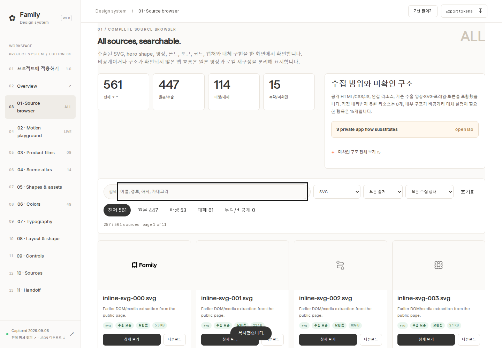
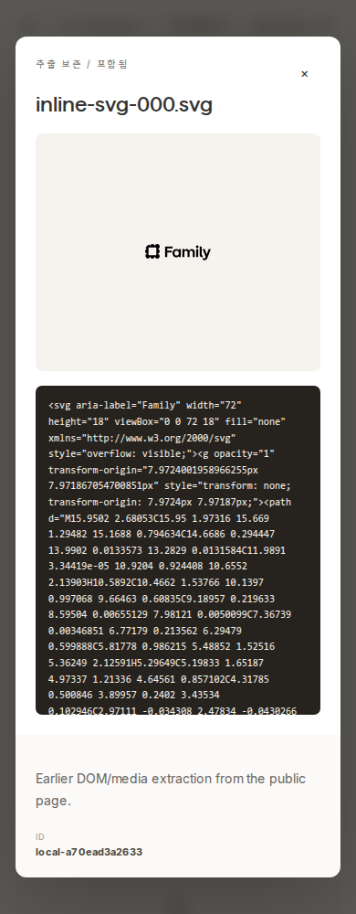
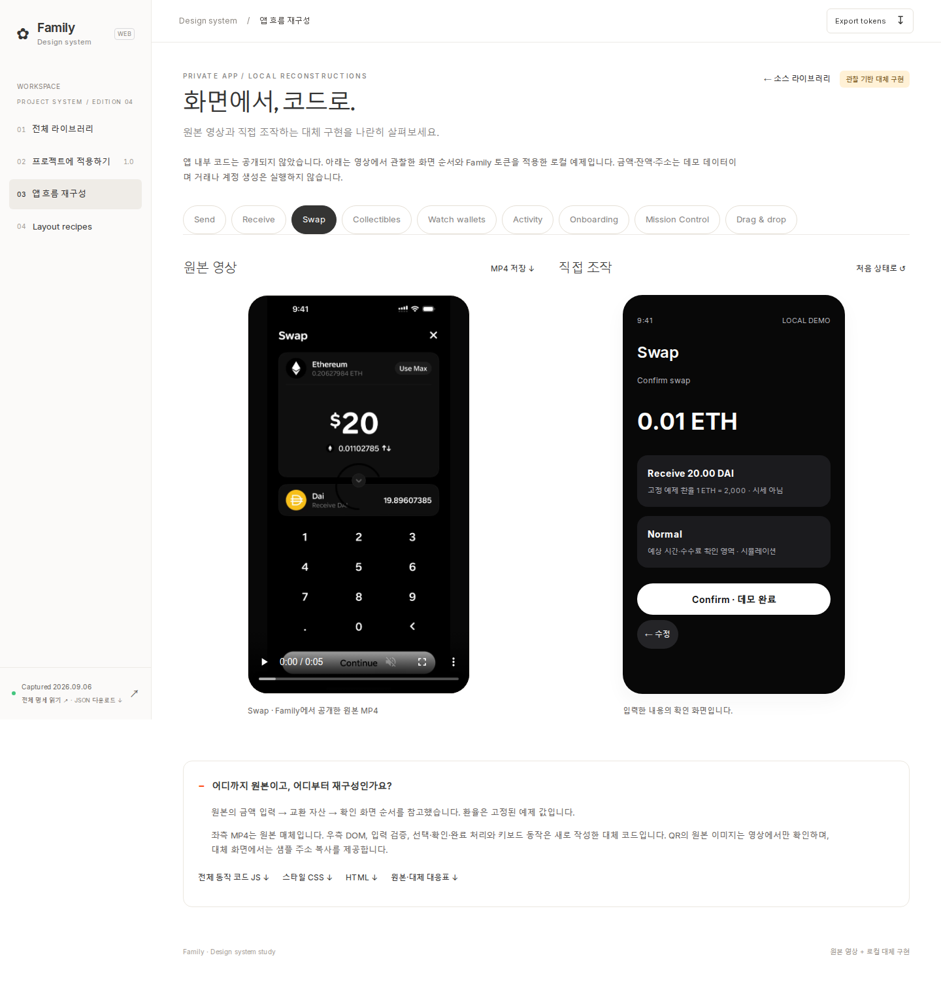

# 소스 수집·오류·열람 UX 점검

## 범위
Family 공개 랜딩 페이지와 기존 Recent 영상에 나타난 디자인 요소, 공개 번들·스타일·미디어, 수집된 DOM/SVG/도형/폰트와 파생 자료. 실제 앱 저장소·서버·연결된 모든 외부 페이지까지 완전 추출했다는 주장은 하지 않는다.

## 확인한 문제와 조치
1. 대표 도형 12개만 보이던 UI에서 전체 소스 목록을 검색·필터·페이지 탐색하고 상세·다운로드할 수 있게 확장.
2. `inline-svg-047/050/052.svg`와 대응 preview 3개에 `&nbsp;` HTML entity가 저장되어 XML parse 실패. 전체 SVG 무결성 검사로 발견, XML 숫자 문자 참조로 수정. 재수집도 XMLSerializer 사용. 원본 HTML/DOM inventory는 그대로 보존.
3. 임시 SVG로 대신하던 Fun carousel 이미지를 이미 수집된 원본 emoji로 교체. 모션 출처의 CSS/원본 수치/토큰/추론을 구분하고 전체 JS/CSS 다운로드 제공.
4. 비공개 앱을 원본 MP4와 아이콘만으로 대체했던 부분에 9개 조작 가능한 로컬 흐름을 추가. 원본 영상과 나란히 비교하고 관찰한 구조와 새로 만든 상태를 명시.
5. 새 소스 탐색기 generator가 다운로드 링크를 script 태그로 오인해 JS 로딩을 건너뛰는 통합 오류를 실제 브라우저에서 발견. 스크립트 태그 여부로 판단하도록 수정하고 실제 로딩을 재검증.

## 사용자 흐름
1. 전체 소스 찾기: 기존 카탈로그의 출처 기반 구성 유지, 자료 전체에 접근하는 진입점 추가.
2. 검색·필터·미리보기: 파일 종류/출처/상태와 검색어로 좁히고 결과가 없으면 즉시 초기화.
3. 상세·가져오기: 원본 URL, 로컬 파일, 크기, SHA-256과 코드 본문 확인. 대체 구현 전체 소스 다운로드.
4. 비공개 구조 비교: 원본 MP4 옆에서 앱 흐름을 직접 조작하고 확인 한계 열람.

## 증거
이번 실행의 `source-browser-validation.json`, `motion-validation-v3.json`, `app-validation.json`, `source-integrity.json`과 desktop/mobile 스크린샷을 기준으로 최종 검증한다. 검사 결과는 각 JSON의 상태와 날짜가 기준이며 이 문서는 테스트 성공을 대신하지 않는다.

스크린샷만으로 전면 접근성 준수를 주장하지 않는다. 키보드·포커스·가로 넘침·리소스 로딩은 별도 실제 브라우저 테스트로 확인한다. 비공개 앱에 대해 픽셀 일치나 내부 구현 일치를 보증하는 결과가 아니다.

## 최종 검증 결과

- 소스 목록: **536개 로컬 파일**, 파일 존재·크기·SHA-256 검증 통과.
- 공개 리소스 **134개 재수집/재검증**, 기록된 다운로드 실패 **0개**. 원본 링크는 [Family 공개 랜딩](https://family.co/)과 매니페스트 각 sourceUrl에 보존.
- 원본/추출 이미지·SVG **402개** 실제 브라우저 디코딩 통과.
- 카탈로그 18개, 모션 10개, 앱 흐름 11개, 소스 브라우저 10개 검증 그룹 통과. 세부 항목은 각 JSON에 기록.
- 전체 목록 23페이지 접근, 검색·모든 카테고리 필터, 빈 결과 초기화, 30KB보다 큰 실제 코드 전체 복사, 키보드 다운로드, Escape 포커스 복귀, 모바일 상세창 및 file:// 열기 검증 통과.
- 1440 / 768 / 390px 화면에서 가로 넘침과 로컬 리소스 실패 없음.
- 확인 불가 항목 15개는 과거 영상 빌드, 비공개 앱 소스, 미공개 번들 소스맵. 대체 구현·관찰 보고서와 연결. 원본 미확인 코드 확보로 표시하지 않음.

## 이번 실행 화면

### 1. 전체 자료 찾기 — 정상

검색·필터·출처 구분과 모든 자료 접근을 확인했습니다. 작은 원본 SVG 중 비어 있는 spacer도 수집 근거를 위해 그대로 보존합니다.

### 2. 소스 상세·코드·다운로드 — 정상

모바일에서는 미리보기·코드·메타데이터가 세로로 이어집니다. 코드 미리보기는 길이를 제한하지만 전체 본문 복사와 다운로드는 원본 전체 파일을 대상으로 합니다.

### 3. 원본 영상과 비공개 구조의 대체 UI 비교 — 정상

앱 원본 매체와 새로 작성한 대체 UI의 경계를 화면에서 확인할 수 있습니다. 원본 앱과 동일한 픽셀·내부 로직으로 검증한 결과는 아닙니다.
